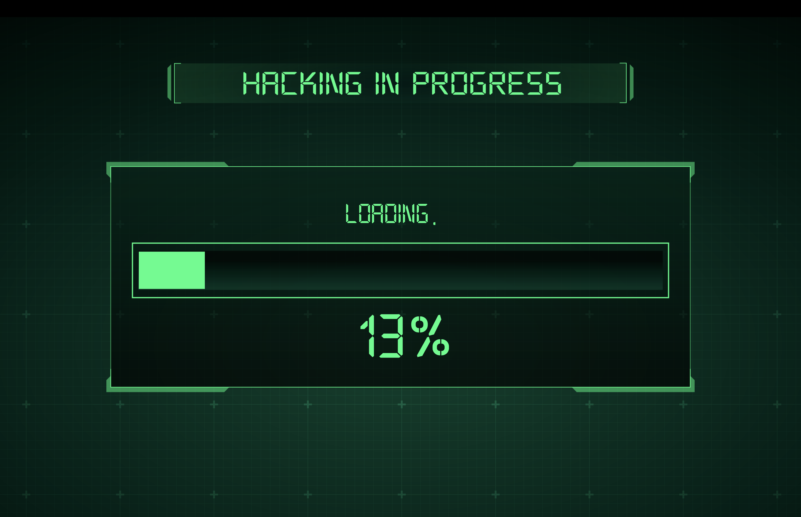
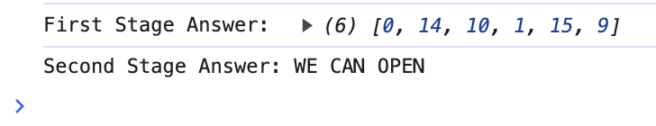

# BlackGhost

BlackGhost is a web-based puzzle game built for Korean reality game show, [Treasure Hunt](https://g.co/kgs/mBw3WFN).

<em style="color:gray">Some parts of game show</em>  

 

It consists of two stages, decrypting pattern code and alphabet code for each. All design assets were provided from broadcasting company.

 

It is implemented based on **React**, packed as an app by **Electron**. To be utilized in a game, its auto-play and termination logic have been developed with a shell script using **Automator** to run in the background process.

By executing background process, the game will be auto played when usb is insterted. Then it will show 2 clue images for next step, after the game termination.

## Test in a browser

Execute following command to run with your local environment **http://localhost:3000**.

### `npm run start`

For your convenience, the answers will be printed in the console.

<em>For the first stage, click the corresponding patterns in an order. Indices are start with 0.</em>

## Test as an app

1. Download program files from [here](https://drive.google.com/drive/folders/1qoyDKnirwO-UgYFUYT7PdCrX-oYPNxAS?usp=drive_link).
2. Locate all files in the **Downloads** folder.
3. Remove program attribute by executing following command. This process is necessary to open unauthorized program with macos.

   `xattr -cr 'Downloads/Background.app'`

   `xattr -cr 'Downloads/BlackGhost.app'`

4. Move 2 program files (Background, BlackGhost) to **Applications** folder.
5. Execute background program. It will start the game when usb is inserted.
   <em>Execute condition will be vary by devices, since it counts the number of ports.</em>
